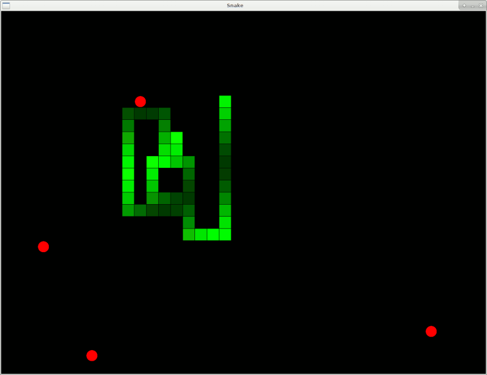
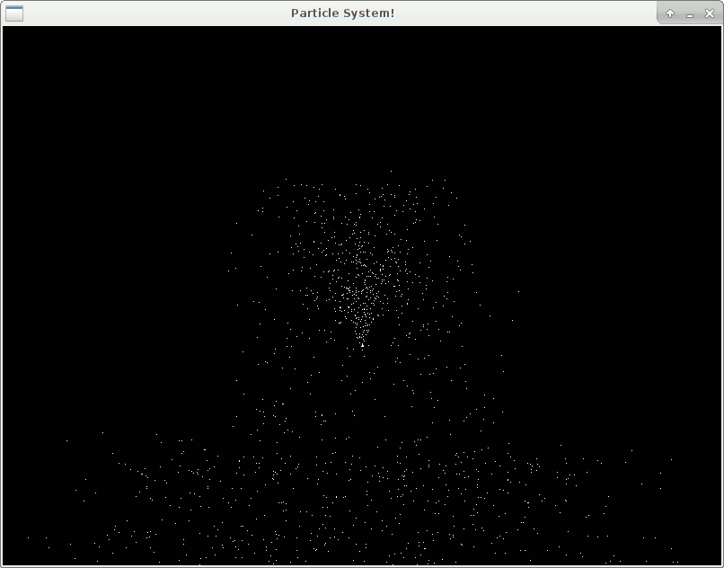
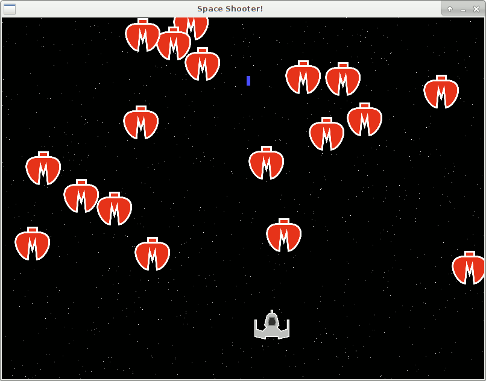
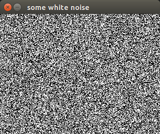

# SDL2::Raw

 [](https://travis-ci.org/timo/SDL2_raw-p6) [](https://ci.appveyor.com/project/timo/SDL2_raw-p6/branch/master)

A low-sugar binding to SDL2.

## Synopsis

```perl6
use SDL2::Raw;

die "couldn't initialize SDL2: { SDL_GetError }"
  if SDL_Init(VIDEO) != 0;

my $window = SDL_CreateWindow(
    "Hello, world!",
    SDL_WINDOWPOS_CENTERED_MASK, SDL_WINDOWPOS_CENTERED_MASK,
    800, 600,
    OPENGL
);
my $render = SDL_CreateRenderer($window, -1, ACCELERATED +| PRESENTVSYNC);

my $event = SDL_Event.new;

main: loop {
    SDL_SetRenderDrawColor($render, 0, 0, 0, 0);
    SDL_RenderClear($render);

    while SDL_PollEvent($event) {
        if $event.type == QUIT {
            last main;
        }
    }

    SDL_SetRenderDrawColor($render, 255, 255, 255, 255);
    SDL_RenderFillRect($render,
        SDL_Rect.new(
            2 * min(now * 300 % 800, -now * 300 % 800),
            2 * min(now * 470 % 600, -now * 470 % 600),
        sin(3 * now) * 50 + 80, cos(4 * now) * 50 + 60));

    SDL_RenderPresent($render);
}
SDL_Quit;
```

## Status

There's a bunch of functions and structs already covered, but there's also a whole bunch of things I haven't touched at all. If you need any specific part of the API covered, feel free to open a ticket on github or even a pull request!

## Installation

|Platform|Installation|
|-|-|
|Ubuntu 14.04 and above|`sudo apt install libsdl2-dev`|
|Fedora 25 and above|`yum install SDL2-devel`|
|Arch Linux|`pacman -S sdl2`|
|Gentoo|`emerge -av libsdl2`|
|macOS|`brew install sdl2 pkg-config`|
|Windows|https://libsdl.org/download-2.0.php|

## Examples

### Snake



A simple Snake game. Control it with the arrow keys, guide your snake to eat the red circles, and avoid running into your tail.

This code uses `Cairo` to create the images for the snake's body and tail.

### Particles



A very simple particle system that spews white pixels from a central point that get pulled down by gravity and bounce on the floor.

### Shooter



A more complicated game. Control it with the arrow keys and hold the spacebar to fire.

The code also uses `Cairo` to render the player's spaceship and the enemy spaceships. In generating the starfields it shows how to render to a texture with `SDL2`.

### White Noise

Just draws random white and black pixels to a texture and displays it.


